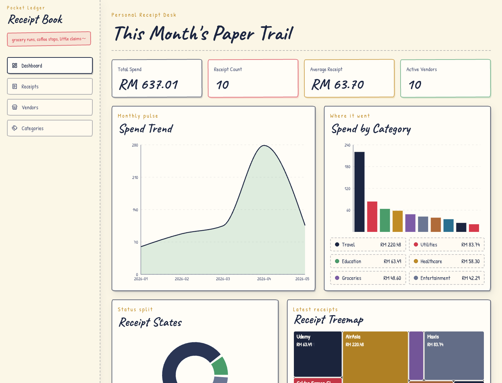
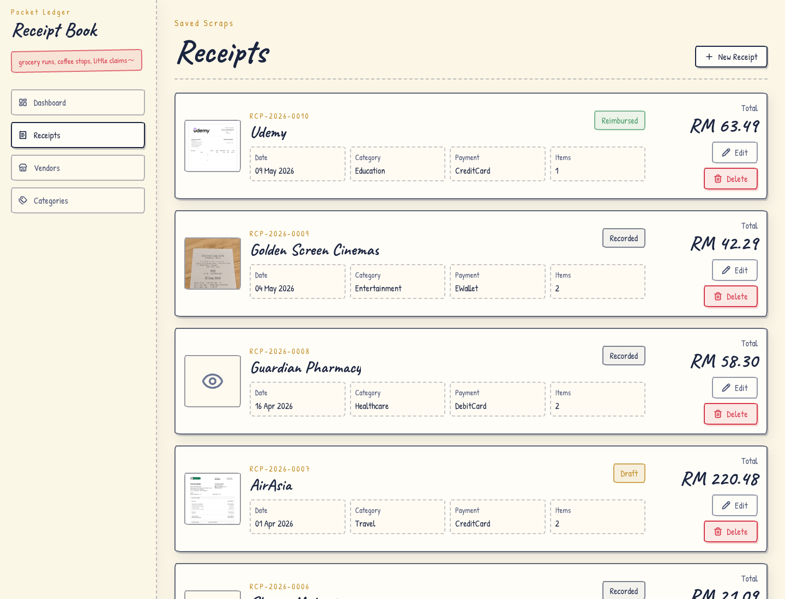
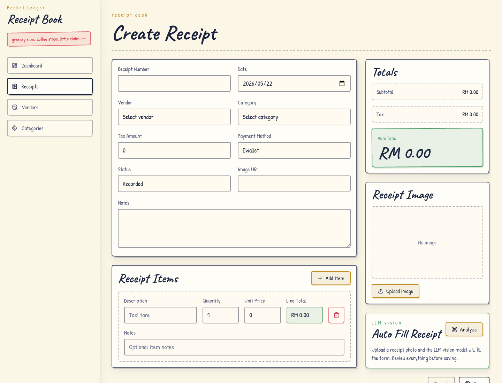
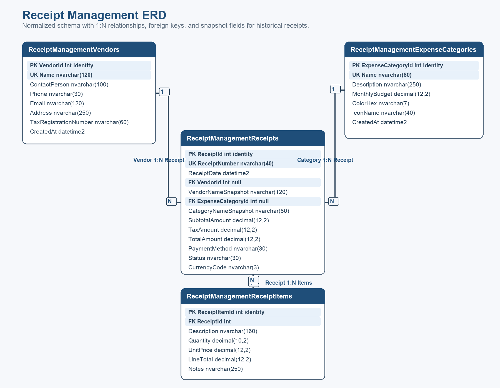

# Receipt Management Application

SWE310 coursework project for managing expense receipts, vendors, and expense categories. The application has a React frontend, an ASP.NET Core Web API, a service/repository backend structure, and a SQL Server database seeded with receipt data.

## Screenshots









## Project Summary

- CRUD for receipts, vendors, and expense categories.
- MSSQL schema with seed data for vendors, categories, receipts, and receipt items.
- Dashboard charts for monthly totals, category spend, and recent receipts.
- Receipt image upload with backend-only LLM extraction support.
- Frontend and backend validation for required fields, lengths, email, hex color, money ranges, and image rules.
- Backend service, controller, and integration tests covering success and error responses.

## Tech Stack

- Backend: .NET 9, ASP.NET Core Web API, Entity Framework Core
- Database: SQL Server 2022 in Docker, T-SQL setup script
- Frontend: Vite, React, React Router, Axios, Tailwind CSS, Recharts, lucide-react
- Testing and quality: xUnit, WebApplicationFactory integration tests, ESLint, Vite production build

## Configure Environment

Create local backend and database environment values:

```bash
cp .env.example .env
set -a; source .env; set +a
```

Root `.env` values:

- `SQL_PASSWORD`: SQL Server `sa` password used by Docker, `sqlcmd`, and the API connection string.
- `SILICONFLOW_API_KEY`: optional server-side key for receipt image analysis. Leave the example value if AI analysis is not being tested.
- `SILICONFLOW_BASE_URL`, `SILICONFLOW_VISION_MODEL`, `SILICONFLOW_JSON_MODE`: optional image analysis settings.

The frontend defaults to `http://localhost:5068/api`. If the API URL changes, copy `receipt-management-client/.env.example` to `receipt-management-client/.env` and update `VITE_API_BASE_URL`.

## Start SQL Server

```bash
docker compose up -d
```

## Execute SQL Script

Create and seed `ReceiptManagementDb`:

```bash
docker exec -i receipt-management-sqlserver /opt/mssql-tools18/bin/sqlcmd \
  -S localhost -U sa -P "$SQL_PASSWORD" -C \
  -i /dev/stdin < database/scripts/001_create_receipt_management_db.sql
```

The script creates vendors, expense categories, receipts, receipt items, primary keys, foreign keys, unique constraints, check constraints, and seed rows.

## Start API

```bash
dotnet run --project ReceiptManagement.Api/ReceiptManagement.Api.csproj --urls http://localhost:5068
```

Swagger runs at http://localhost:5068/swagger in Development.

## Start Frontend

```bash
cd receipt-management-client
npm install
npm run dev
```

Frontend runs at http://127.0.0.1:5173.

## Verification

Backend tests:

```bash
dotnet test ReceiptManagement.Api.Tests/ReceiptManagement.Api.Tests.csproj
```

Frontend lint and production build:

```bash
cd receipt-management-client
npm run lint
npm run build
```
